# Expense Tracker

A simple, interactive expense tracker web app built with **Streamlit** and **SQLAlchemy**.  
You can add, edit, and analyze your purchases with an Excel-like interface and visual graphs.

---

## Features

- **Add Purchases:**  
  Enter item name, type, quantity, price (₹), and date of purchase in a dynamic table.

- **Editable Expenses Table:**  
  View and edit all your expenses directly in the web app. Save changes to the database.

- **Purchase Analysis:**  
  Visualize your spending with:
  - Bar charts for each date (item type vs. price)
  - A summary chart for all days in the current month

- **Rupee Symbol Support:**  
  All prices are displayed with the ₹ symbol.

---

## Setup Instructions

1. **Clone the repository:**
    ```
    git clone <your-repo-url>
    ```

2. **Install dependencies:**
    ```
    pip install -r requirements.txt
    ```

3. **Run the app:**
    ```
    streamlit run src/app.py
    ```

## Project Flow Chart

```mermaid
graph TD
    A[📸 Capture Image] --> B[📤 Upload Image]
    B --> C[🛠️ Image Processing]
    C --> D[🧪 Testing Image]
    D --> E[🧠 Convolutional Neural Network]
    E --> F[📚 Training Image]
    F --> G[🌿 Leaf Disease Detection]

    style A fill:#d2f8d2,stroke:#228B22,stroke-width:2px
    style G fill:#fddede,stroke:#B22222,stroke-width:2px

```


expense-tracker/
├── src/
│   ├── app.py
│   ├── db.py
│   └── ...
├── requirements.txt
└── README.md
```

---

## Customization

- **Categories:**  
  You can edit the lists for item names and types in `app.py` to match your needs.

- **Database:**  
  Uses SQLite by default. You can change the database URL in `db.py` for other SQL databases.
